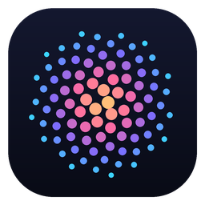
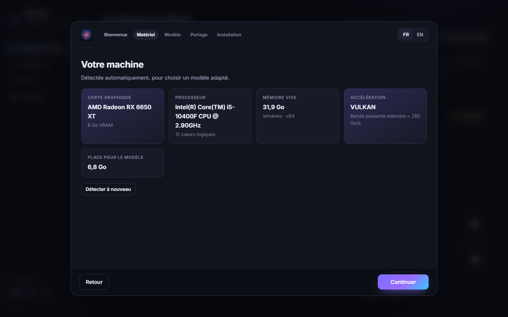

<p align="center">
  
</p>

<h1 align="center">Myriad</h1>
<p align="center"><b>A myriad of small models, one answer.</b><br>
<i>Une myriade de petits modèles, une seule réponse.</i></p>

<p align="center">
  <a href="https://github.com/amintt2/myriad/releases">Download</a> ·
  <a href="#how-it-works">How it works</a> ·
  <a href="RESEARCH.md">Research</a> ·
  <a href="app/README.md">Documentation (FR)</a> ·
  <a href="CONTRIBUTING.md">Contributing</a>
</p>


**English.** Myriad is a decentralised LLM. Every computer runs one small open model (Qwen, Gemma,
Granite, SmolLM, Ministral, Phi…) and lends it to the network; in return it can ask the whole network.
A question goes at once to several peers of *different model families*, and their answers are fused
by a weighted vote. Four 1.7–3 B models voting reach 89.0 % on GSM8K, against 91.0 % for a single 4 B
model — on hardware that people already own.

**Français.** Myriad est un LLM décentralisé. Chaque ordinateur fait tourner un petit modèle ouvert et
le prête au réseau ; en échange, il peut interroger tout le réseau. Une question part en même temps
vers plusieurs pairs de *familles de modèles différentes*, et leurs réponses sont fusionnées par un vote
pondéré. Quatre modèles de 1,7 à 3 milliards de paramètres atteignent ensemble 89,0 % sur GSM8K, contre
91,0 % pour un seul modèle de 4 milliards. La documentation détaillée est en français :
[`app/README.md`](app/README.md).

## Features

- **Desktop app** for Windows, macOS and Linux: native window, tray / menu-bar icon (open, pause,
  resume, quit), one instance per user, clean shutdown of the model server.
- **First-run wizard**: detects your GPU and memory (NVIDIA, AMD, Intel, Apple Silicon, or CPU only),
  recommends a model from a curated catalogue of **Apache-2.0 / MIT models only**, estimates its speed,
  and downloads the llama.cpp engine and the model with **SHA-256 verification and resume**.
- **Live dashboard**: an animated map of the network (your node at the centre, peers coloured by model
  family, sparks when jobs flow), peers online, model families, network and personal tokens/s, credits
  earned and spent.
- **Chat playground** that shows the swarm at work: which peers got the question, what each answered,
  their weights, the vote and the *stop certificate* (the answer that can no longer be overturned,
  so stragglers are cancelled).
- **OpenAI-compatible local API** on `http://127.0.0.1:8400/v1` (model `myriad`): use the network from
  any OpenAI client.
- **No port to open**: one outbound WebSocket to a tracker; signed jobs, results and receipts (ed25519).
- French and English UI, dark and light themes, bundled fonts, nothing loaded from the internet by
  the interface.

| | |
| --- | --- |
|  |  |
|  |  |

## Install

Download the latest build from **[Releases](https://github.com/amintt2/myriad/releases)**:

| System | File |
| --- | --- |
| Windows 10/11 x64 | `Myriad-Setup-X.Y.Z.exe` (per-user, no admin rights) or the portable `.zip` |
| macOS 11+ Apple Silicon / Intel | `Myriad-X.Y.Z-arm64.dmg` / `Myriad-X.Y.Z-x86_64.dmg` |
| Linux x86_64 | `.AppImage`, `.deb` or `.tar.gz` |

Builds are **not code-signed yet**. Windows SmartScreen: *More info* → *Run anyway*. macOS Gatekeeper:
right-click the app → *Open* (or *System Settings* → *Privacy & Security* → *Open Anyway*). Checksums
are in `SHA256SUMS.txt`.

From source (Python ≥ 3.11 and [uv](https://docs.astral.sh/uv/)):

```bash
cd app
uv sync --extra desktop
uv run myriad-desktop                  # the desktop app
uv run python scripts/demo_swarm.py    # a local demo network, no GPU needed
```

## How it works

```
 your PC                                   tracker (public VM)                      peers
 ┌─────────────────────────┐   HTTPS/WSS   ┌──────────────────────────┐   WSS (outbound)   ┌──────────────┐
 │ Myriad app              │ ────────────▶ │ directory, peer choice   │ ◀───────────────── │ Myriad node  │
 │  node + llama-server    │   signed jobs │ relay (no model runs)    │  jobs / results    │ llama-server │
 │  gateway :8400 (OpenAI) │ ◀──────────── │ credits ledger, receipts │ ─────────────────▶ │ (Gemma, …)   │
 │  UI :8401               │               │ reliability per model    │                    └──────────────┘
 └─────────────────────────┘               └──────────────────────────┘
```

1. **One round trip.** Your gateway sends the same signed job to *k* peers of different families at
   once (through the tracker relay, so nobody opens a port).
2. **Weighted vote.** When a final answer can be extracted (a number, a letter), each peer votes with
   weight logit(p) − ln(c): p is its model's measured reliability, c the chance that two wrong peers
   agree. Otherwise the *medoid* answer (closest to the others) wins.
3. **Stop certificate.** As soon as the leading answer outweighs the runner-up plus every peer still
   pending, the result is final: the gateway answers and cancels the stragglers.
4. **Credits.** Serving earns credits (tokens × model size); asking spends them; every settlement is
   backed by signed receipts.

The research behind it — the experiments, their results and how to reproduce them — is summarised in
[`RESEARCH.md`](RESEARCH.md); the code and raw results are in [`phase0/`](phase0/README.md),
[`app/bench/`](app/bench/) and [`paper/`](paper/).
The default public tracker is `https://myriad.french-web.com` (not deployed yet; you can run your own:
`myriad tracker`, see [`app/README.md`](app/README.md#déployer-le-traqueur)).

**Limits today.** The tracker is a central point (rendezvous, relay, ledger); questions are not
end-to-end encrypted (the tracker and the peers asked can read them); a new key gets starter credits
(Sybil resistance is future work). See the "Limites" section of `app/README.md`.

## Licence

Apache-2.0 — see [`LICENSE`](LICENSE) and [`NOTICE`](NOTICE). Bundled fonts: SIL Open Font License.
Models are downloaded from Hugging Face under their own licences (Apache-2.0 or MIT only).
