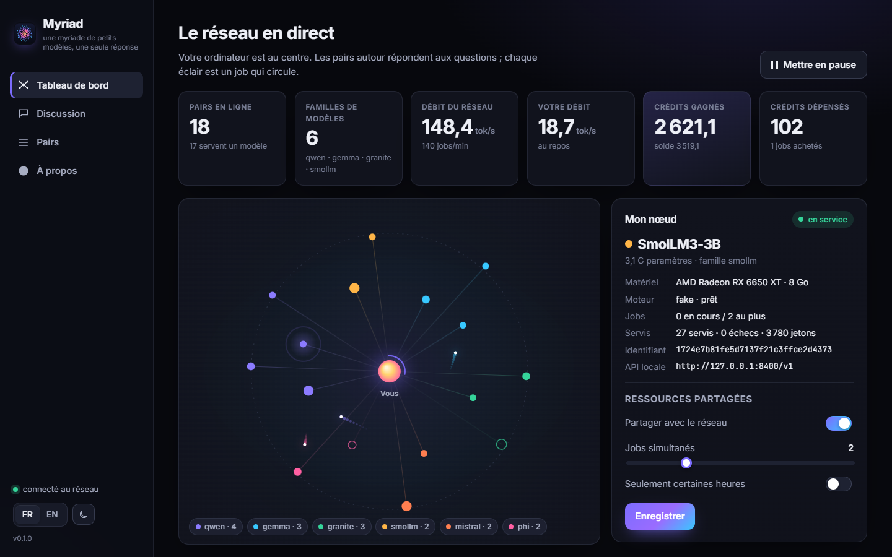
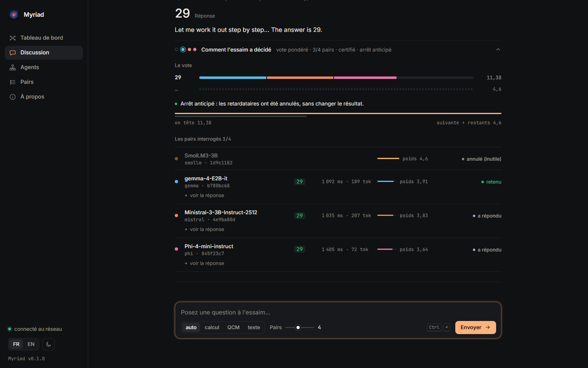
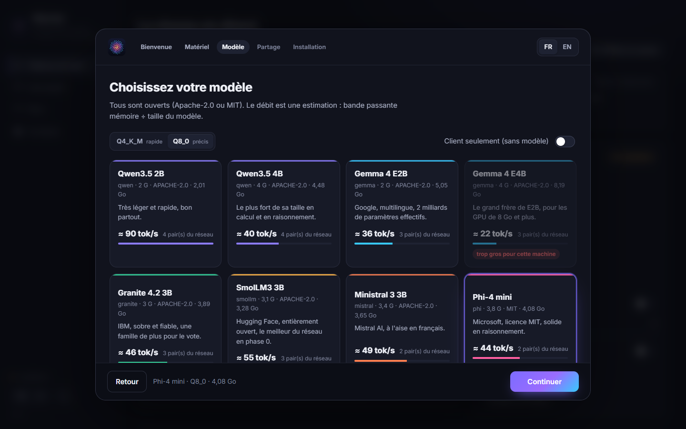
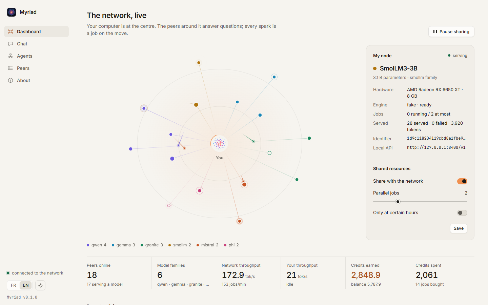
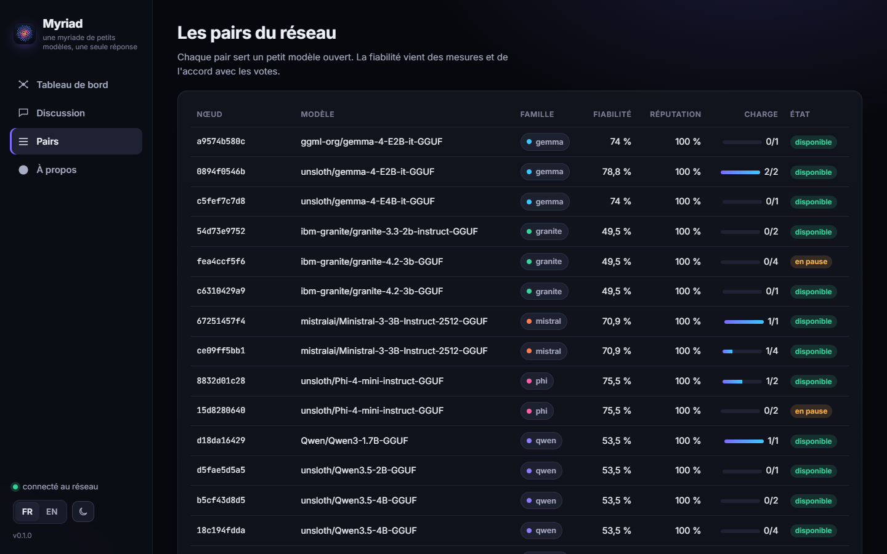
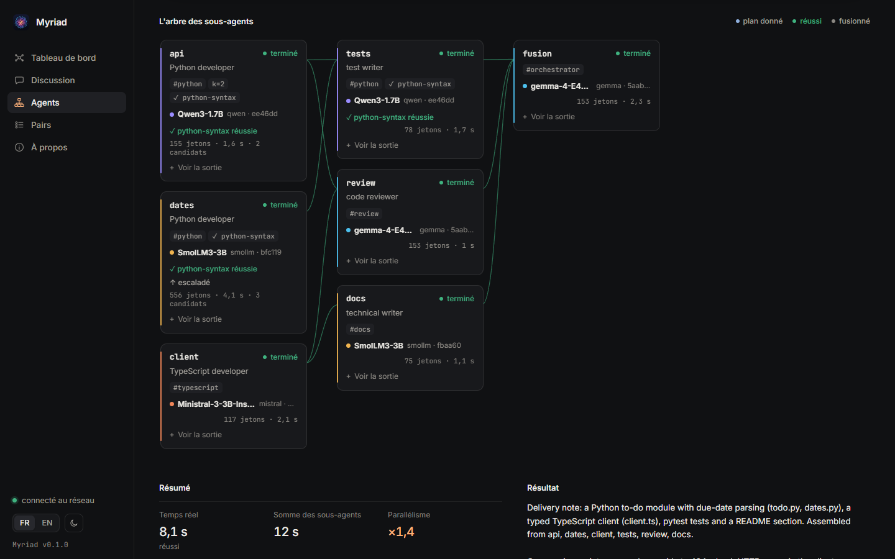
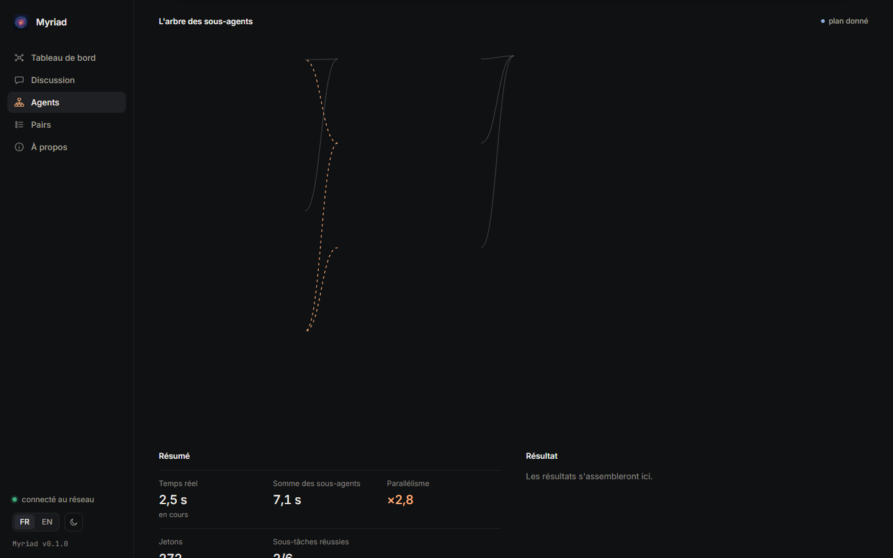
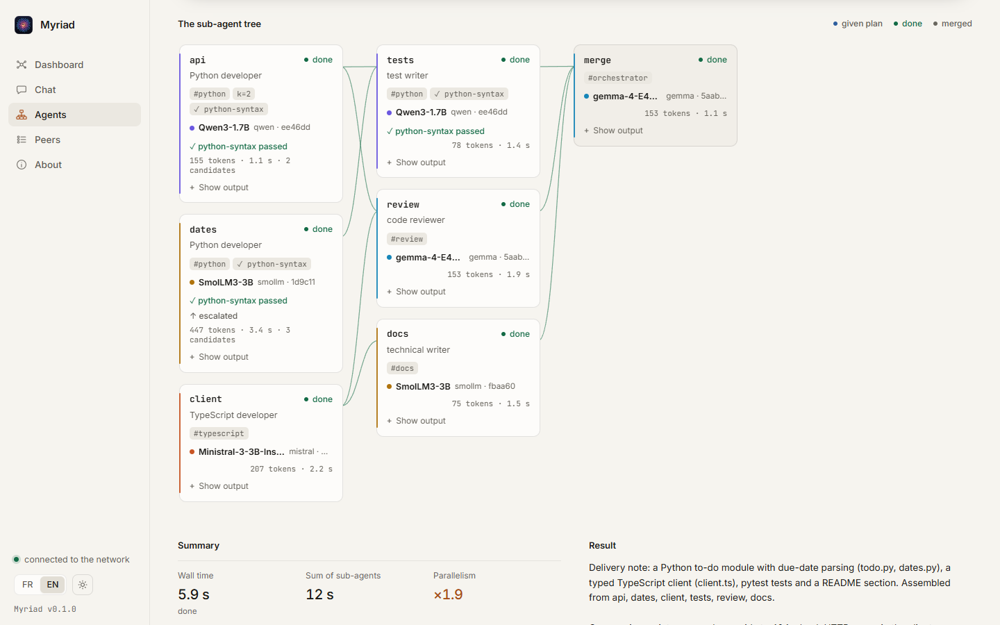

# Myriad (paquet Python `myriad`)

**Une myriade de petits modèles, une seule réponse.** Myriad est un LLM décentralisé. Chaque PC fait
tourner **un nœud** qui sert un petit modèle ouvert (Qwen, Gemma, Granite, SmolLM, Ministral, Phi…)
avec llama.cpp. En échange, il peut interroger **le réseau** : la même question part vers plusieurs
pairs de **familles de modèles différentes**, et leurs réponses sont fusionnées. Les mesures de la
phase 0 montrent que le vote de quatre modèles de 1,7 à 3 milliards de paramètres atteint 89,0 % sur
GSM8K, contre 91,0 % pour Qwen3-4B (`phase0/results/`).

Licence : Apache-2.0 (`LICENSE` à la racine).

**Ancien nom : `essaim`.** Le paquet Python s'appelait `essaim` ; il s'appelle maintenant `myriad`,
comme le produit. Ce qui reste compatible :

- les commandes `essaim` et `essaim-desktop` restent des alias (dépréciés) de `myriad` et
  `myriad-desktop` ; la variable `ESSAIM_HOME` est encore lue si `MYRIAD_HOME` est absente ;
- au premier lancement, un dossier de données `essaim` existant est **copié** vers `myriad` (clé,
  configuration, modèles, moteur, journaux ; les gros fichiers sont liés en dur quand c'est possible).
  L'ancien dossier n'est jamais modifié ni supprimé. Si une ancienne instance de l'app de bureau
  l'utilise encore, ou si la copie échoue, l'ancien dossier est utilisé tel quel et la copie est
  retentée au lancement suivant ;
- l'API compatible OpenAI accepte le modèle `essaim` et le champ `essaim` de la requête comme alias de
  `myriad`, et la réponse porte les métadonnées sous `myriad` **et** sous `essaim` (alias déprécié, même
  contenu) ; `/v1/essaim/status` répond comme `/v1/myriad/status` ;
- **les identifiants du protocole ne changent pas** : `essaim/1` et `essaim/1.1`. `essaim/1` préfixe
  chaque message signé (jobs, résultats, reçus, réponse au défi) et c'est la version annoncée par chaque
  nœud : le renommer rendrait les nœuds, passerelles et traqueurs déjà déployés incompatibles avec les
  nouveaux (signatures refusées). C'est le nom du protocole, plus celui du paquet.

Spécification : `../docs/05_spec_app.md`. La recherche : `../RESEARCH.md`.



## L'application de bureau

Pour la plupart des gens, c'est la façon de rejoindre le réseau : une fenêtre, une icône dans la zone
de notification, un assistant d'installation. Rien à installer à la main (ni Python, ni llama.cpp).

### Installer

Télécharger la dernière version dans les
[Releases](https://github.com/amintt2/myriad/releases) :

| système | fichier | |
| --- | --- | --- |
| Windows 10/11 (x64) | `Myriad-Setup-X.Y.Z.exe` | installation pour l'utilisateur, sans droits d'administrateur |
| Windows, sans installation | `Myriad-X.Y.Z-windows-x64-portable.zip` | décompresser, lancer `Myriad\Myriad.exe` |
| macOS 13.3+ (Apple Silicon) | `Myriad-X.Y.Z-arm64.dmg` | glisser Myriad dans Applications |
| macOS (Intel) | `Myriad-X.Y.Z-x86_64.dmg` | |
| Linux x86_64 | `Myriad-X.Y.Z-x86_64.AppImage`, `myriad_X.Y.Z_amd64.deb`, `.tar.gz` | |

Les empreintes SHA-256 sont dans `SHA256SUMS.txt`.

**Les versions ne sont pas encore signées.** Au premier lancement :

- **Windows (SmartScreen)** : « Windows a protégé votre ordinateur » → *Informations
  complémentaires* → *Exécuter quand même*.
- **macOS (Gatekeeper)** : « Myriad ne peut pas être ouvert… » → clic droit sur l'app → *Ouvrir* →
  *Ouvrir*. Sinon : *Réglages Système* → *Confidentialité et sécurité* → *Ouvrir quand même*. En
  dernier recours : `xattr -dr com.apple.quarantine /Applications/Myriad.app`.
- **Linux** : `chmod +x Myriad-*.AppImage` puis le lancer (il faut `libfuse2`), ou
  `sudo apt install ./myriad_*.deb` puis `myriad`.

### Premier lancement : l'assistant

1. **Matériel** : carte graphique et mémoire vidéo (`nvidia-smi`, registre Windows, `vulkaninfo`,
   mémoire unifiée des puces Apple), mémoire vive, processeur.
2. **Modèle** : un catalogue de modèles ouverts **Apache-2.0 ou MIT seulement**, aux révisions et aux
   empreintes SHA-256 épinglées (`myriad/catalog.py`) : Qwen3.5 2B et 4B, Gemma 4 E2B et E4B,
   Granite 4.2 3B, SmolLM3 3B, Ministral 3 3B, Phi-4 mini. Q4_K_M par défaut (rapide), Q8_0 en option.
   Le débit attendu est estimé par *bande passante mémoire × rendement ÷ taille du fichier* (60 % sur
   GPU, 50 % sur CPU). La recommandation prend le plus gros modèle qui tient en mémoire et reste
   assez rapide, avec un bonus pour une famille absente du réseau (le vote gagne à la diversité).
   « Client seulement » : interroger le réseau sans servir de modèle.
3. **Partage** : partager ou non, jobs simultanés, plages horaires ; traqueur et moteur dans les
   réglages avancés.
4. **Installation** : llama.cpp (version épinglée **b11505**, binaire officiel de GitHub : Metal sur
   Apple Silicon, **Vulkan** pour toute autre carte graphique — un seul petit téléchargement qui
   marche sur NVIDIA, AMD et Intel —, CPU sinon ; CUDA en option), puis le modèle depuis Hugging
   Face. Chaque fichier est vérifié par son SHA-256 (table épinglée), et **les téléchargements
   reprennent là où ils se sont arrêtés** (requêtes HTTP `Range`, fichier `.part`). Un llama-server déjà
   présent (configuration, `LLAMA_SERVER`, `PATH`) est réutilisé. Puis la clé du nœud est créée et le
   nœud démarre.

### Le tableau de bord

- **La carte du réseau en direct** : votre nœud au centre, les pairs autour, une couleur par famille
  de modèles, un éclair à chaque job qui circule (les vôtres, et le trafic du réseau).
- **Les compteurs** : pairs en ligne, familles, débit du réseau (jetons/s sur la dernière minute),
  votre débit, crédits gagnés et dépensés (`GET /v1/stats` du traqueur).
- **Votre nœud** : modèle, matériel, moteur, jobs, et les ressources partagées (modifiables, avec
  pause et reprise).
- **La discussion** : une conversation ; chaque question part vers k pairs, et chaque réponse est suivie
  d'un volet repliable « Comment l'essaim a décidé » : qui a reçu la question, qui répond et quoi (en
  direct), puis le poids de chaque pair, le vote et le **certificat d'arrêt** (la réponse en tête dépasse
  la suivante plus tout ce qui n'a pas encore répondu : les retardataires sont annulés).
- **À propos** : l'idée en trois lignes, le lien vers la recherche, l'API locale compatible OpenAI.
- Français par défaut, anglais en un clic ; thème sombre ou clair ; polices embarquées (Inter,
  JetBrains Mono, licence OFL) ; aucune ressource externe n'est chargée.

| | |
| --- | --- |
|  |  |
|  |  |

Si le traqueur ne répond pas (le traqueur public `https://myriad.french-web.com` n'est pas encore en
service), un bandeau l'explique, le nœud réessaie tout seul (attente doublée jusqu'à 30 s), et l'on
peut choisir un autre traqueur sans tout réinstaller.

### Fenêtre, zone de notification, arrêt

- Fermer la fenêtre **ne coupe pas** le nœud : il continue dans la zone de notification (icône
  Myriad : *Ouvrir*, *Mettre en pause le partage* / *Reprendre*, *Quitter*). *Quitter* arrête le nœud
  et **termine llama-server**.
- Une seule instance par dossier de données : relancer Myriad affiche la fenêtre existante.
- Options de `Myriad` (ou `myriad-desktop` depuis les sources) : `--hidden` (démarrer dans la zone de
  notification), `--browser` (le navigateur au lieu d'une fenêtre), `--headless` (ni fenêtre ni icône :
  pour un serveur), `--stop` (arrêter proprement l'instance en cours), `--tracker URL`, `--home DOSSIER`.
- Sans moteur de fenêtre (pywebview absent), l'interface s'ouvre dans le navigateur par défaut.
- Journaux : `<dossier de données>/logs/` (`myriad.log`, et un journal par llama-server).

### Mises à jour

Myriad sait qu'une nouvelle version existe **sans interroger GitHub depuis chaque PC** : le traqueur
surveille les versions publiées (une requête conditionnelle toutes les 10 minutes pour tout le réseau) et
l'annonce aux nœuds, à la connexion puis dès qu'elle paraît. L'app redemande au traqueur au démarrage et
toutes les 6 heures (`GET /v1/version`) ; elle n'interroge l'API GitHub elle-même que si le traqueur est
injoignable ou trop ancien.

- Par défaut, la nouvelle version est **téléchargée en arrière-plan** (reprise possible) dans
  `<dossier de données>/updates/`, puis un bandeau propose **« Mettre à jour et redémarrer »** : le nœud
  s'arrête proprement (llama-server compris), la mise à jour s'installe, Myriad redémarre. L'icône de
  notification a aussi *Rechercher une mise à jour*.
- Réglages (*À propos* → *Mises à jour*) : télécharger automatiquement ou seulement prévenir
  (`auto_update`), installer en quittant Myriad (`install_on_quit`, désactivé par défaut).
- **Sécurité** : le traqueur ne dit qu'un numéro de version, vérifié strictement (`X.Y.Z`, jamais
  inférieur à la version installée). L'app construit elle-même l'adresse du fichier à partir du dépôt
  épinglé (`github.com/amintt2/myriad/releases/download/vX.Y.Z/…`) et vérifie son SHA-256 avec le
  `SHA256SUMS.txt` de la même version sur GitHub (jamais celui du traqueur) ; en cas d'écart, le fichier
  est supprimé. Les versions ne sont pas encore signées (signature détachée prévue : `SUMS_SIGNING_KEY`
  dans `myriad/updater.py`).
- Qui se met à jour seul : l'installateur Windows (installation silencieuse Inno Setup), l'app macOS
  dans *Applications* (l'image disque est montée, le paquet `.app` remplacé), l'AppImage Linux (fichier
  remplacé). La version portable Windows, le `.deb`, le `.tar.gz` et les installations depuis les sources
  ou pip reçoivent seulement l'avis et le lien.
- En ligne de commande : `myriad update --check` (vérifier) ou `myriad update`.
- Sur macOS, une app lancée depuis l'image disque ou depuis *Téléchargements* (copie isolée par
  Gatekeeper) ne peut pas se remplacer : la déplacer dans *Applications*.

### Depuis les sources

```bash
cd app
uv sync --extra desktop
uv run myriad-desktop                       # l'app de bureau (fenêtre native)
uv run python scripts/demo_swarm.py         # un réseau de démonstration local, sans GPU
uv run --extra desktop --group build pyinstaller packaging/myriad.spec --noconfirm   # dist/Myriad/
python packaging/smoke_test.py dist/Myriad/Myriad.exe                              # test de fumée
```

`scripts/demo_swarm.py` lance un traqueur, seize pairs simulés de six familles, du trafic, votre nœud
(simulé) avec l'interface, et une seconde interface en mode premier lancement. Les captures d'écran de
`docs/` sont faites par `scripts/screenshots.py` (Chrome ou Edge sans tête, piloté par le protocole
DevTools). L'empaquetage (Windows : PyInstaller, zip portable, installeur Inno Setup ; macOS : `.app`
et `.dmg` ; Linux : `.tar.gz`, AppImage, `.deb`) est dans `packaging/`, et le workflow
`.github/workflows/release.yml` construit tout sur une étiquette `v*`, lance les tests et le test de
fumée sur chaque système, puis dépose les fichiers dans une **release en brouillon**. Les étapes de
signature (Authenticode, Developer ID et notarisation Apple) n'agissent que si les secrets
correspondants existent ; aucun n'est configuré.

## Ce que contient l'app

| élément | rôle | adresse |
| --- | --- | --- |
| nœud | lance llama-server, se connecte au traqueur, exécute les jobs reçus | connexion sortante |
| passerelle | API compatible OpenAI, fusionne les réponses des pairs | `http://127.0.0.1:8400/v1` |
| interface | assistant, tableau de bord, ressources, crédits, pairs, discussion | `http://127.0.0.1:8401/` |
| traqueur | rendez-vous, relais, registre des crédits, fiabilité | une machine publique, port 8500 |

La passerelle et l'interface n'écoutent que sur 127.0.0.1.

## Installation en ligne de commande

Sans l'app de bureau (serveurs, développement). Il faut [uv](https://docs.astral.sh/uv/) et le binaire `llama-server` de
[llama.cpp](https://github.com/ggml-org/llama.cpp/releases) (version CUDA, Metal ou Vulkan selon la
machine ; la version CPU marche aussi, plus lentement).

```bash
cd app
uv sync
```

Indiquer où se trouve `llama-server` : dans le `PATH`, par la variable `LLAMA_SERVER`, ou par
`myriad init --llama-server CHEMIN`.

## Démarrage

```bash
# 1. Clé ed25519, configuration, téléchargement du modèle (Hugging Face, format dépôt:fichier.gguf)
uv run myriad init --model Qwen/Qwen3-1.7B-GGUF:Qwen3-1.7B-Q8_0.gguf --tracker https://myriad.french-web.com

# 2. Le nœud, la passerelle et l'interface (laisser tourner)
uv run myriad node

# 3. Une question à l'essaim
uv run myriad chat "Un stylo coûte 3 euros. Ana en achète 7 et paie avec 50 euros. Combien lui rend-on ?" --details
uv run myriad status
```

- Le traqueur par défaut est le traqueur public `https://myriad.french-web.com` (constante
  `PUBLIC_TRACKER_URL` de `myriad/config.py`, le seul endroit à changer). Pour un traqueur local :
  `--tracker http://127.0.0.1:8500`.
- `essaim` reste un alias (déprécié) de la commande `myriad`.
- `myriad init --no-model` : client seulement (on interroge l'essaim sans servir de modèle).
- `myriad --home DOSSIER …` ou `MYRIAD_HOME` : un autre dossier de configuration (plusieurs nœuds sur
  une même machine, par exemple). Par défaut : `%APPDATA%\myriad` (Windows),
  `~/Library/Application Support/myriad` (macOS), `~/.config/myriad` (Linux).
- Le dossier contient `node_key.pem` (la clé privée du nœud, à ne jamais partager) et `config.json`
  (traqueur, modèle, limites, ports).

N'importe quel client OpenAI fonctionne avec la passerelle :

```python
from openai import OpenAI
client = OpenAI(base_url="http://127.0.0.1:8400/v1", api_key="inutile")
r = client.chat.completions.create(model="myriad", messages=[{"role": "user", "content": "…"}])
print(r.choices[0].message.content, r.myriad)  # r.myriad : pairs interrogés, réponses, poids, décision
```

Options propres à Myriad, dans le champ `myriad` de la requête (l'ancien nom `essaim` est accepté) :
`k` (nombre de pairs, 4 par défaut, 8 au plus), `task_hint` (`math`, `mc`, `free` ; détecté sinon),
`format_instruction` (`false` pour ne pas ajouter la consigne de format), `timeout_s`. `model` vaut
`myriad` (l'essaim ; `essaim` est accepté) ou un modèle précis du réseau (un seul pair, sans fusion).
`stream: true` est accepté : la réponse fusionnée est envoyée en quelques morceaux (flux émulé).

## Noms de modèles : l'essaim, une famille, une compétence

Le champ `model` choisit la route (essaim/1.2, rétrocompatible) :

| `model` | qui répond |
| --- | --- |
| `myriad` (ou `essaim`) | l'essaim fusionné : k pairs de familles différentes (comportement habituel) |
| `myriad:<famille>` (`myriad:qwen`, `myriad:gemma`…) | un pair de cette famille, strictement |
| `myriad:<compétence>` (`myriad:python`, `myriad:typescript`, `myriad:review`, `myriad:orchestrator`…) | un pair qui annonce cette étiquette ; s'il n'y en a aucun, n'importe quel pair, et `route.fallback` vaut `true` dans les métadonnées |
| un modèle du réseau (`Qwen/Qwen3-1.7B-GGUF`) | un pair qui sert ce modèle |

`myriad:<x>` désigne une famille quand `x` en est une (a priori connus ou annuaire), sinon une
compétence ; `myriad:family=<x>` et `myriad:tag=<x>` lèvent l'ambiguïté. Avec une compétence, un seul
pair répond par défaut ; `myriad.k` en demande plusieurs (de familles différentes, fusionnés).

Chaque nœud annonce ses étiquettes dans son `Hello` : celles de `config.json` (`"tags": ["python",
"review"]`) et celles lues dans le nom du modèle de base (`code` pour un modèle « coder »,
`orchestrator` et `review` à partir d'environ 4 G paramètres) ; les adaptateurs LoRA chargés plus tard
ajouteront les leurs. Le traqueur range chaque nœud sélectionnable dans un index par (étiquette, modèle),
mis à jour en O(1) comme les autres : choisir un pair par compétence coûte O(k), quel que soit le
nombre de nœuds. Un traqueur antérieur refuse un `Hello` avec étiquettes : le nœud se reconnecte aussitôt
sans elles. Une passerelle ne route par étiquette ou famille que si le traqueur annonce la fonction
`tags` (`GET /v1/health`) ; sinon elle choisit dans l'annuaire.

`GET /v1/models` liste toutes les routes avec des comptes en direct (champ `myriad` de chaque entrée :
`kind`, `peers`, `available`), ce qui permet à un client de proposer les compétences disponibles.

### Avec un agent de programmation (Aider, OpenHands, Continue…)

La passerelle parle l'API OpenAI : il suffit de lui donner l'adresse et un nom de modèle.

```bash
# Aider (via LiteLLM : préfixe openai/)
aider --openai-api-base http://127.0.0.1:8400/v1 --openai-api-key inutile \
      --model openai/myriad:python --weak-model openai/myriad

# OpenHands : Paramètres > LLM > avancé
#   Custom model : openai/myriad:orchestrator   Base URL : http://127.0.0.1:8400/v1   API key : inutile
#   (OpenHands en Docker : la passerelle n'accepte que l'hôte 127.0.0.1/localhost, lancer le conteneur
#    avec --network host, ou OpenHands hors Docker)
```

```yaml
# Continue (config.yaml)
models:
  - name: Myriad (Python)
    provider: openai
    model: myriad:python
    apiBase: http://127.0.0.1:8400/v1
    apiKey: inutile
```

```python
# OpenAI Agents SDK / LangGraph : un modèle par rôle
from openai import AsyncOpenAI
from agents import Agent, OpenAIChatCompletionsModel
client = AsyncOpenAI(base_url="http://127.0.0.1:8400/v1", api_key="inutile")
reviewer = Agent(name="review", model=OpenAIChatCompletionsModel(model="myriad:review", openai_client=client))
```

La passerelle ne fait pas d'appel d'outils natif (`tools` est ignoré) : utiliser le mode « sans
function calling » de l'outil (format d'édition texte d'Aider, mode simulé d'OpenHands).

## Sous-agents (mode multi-agents)

Comme un agent de programmation qui délègue à des sous-agents : une tâche est découpée en sous-tâches,
chacune confiée à un pair différent **en parallèle**, avec son propre petit contexte ; les résultats
sont vérifiés localement, escaladés en cas d'échec, puis assemblés.



- **Plan** : explicite (liste de sous-tâches) ou `"auto"` : un pair orchestrateur (étiquette
  `orchestrator`, n'importe quel pair sinon) écrit le plan en JSON, validé par un schéma strict (tout
  champ inconnu est refusé ; un pair ne peut nommer ni fichier local ni commande). Un plan invalide est
  redemandé une fois avec l'erreur.
- **Parallélisme** : les sous-tâches prêtes partent ensemble, un aller-retour chacune ; une sous-tâche
  attend ses dépendances (`depends_on`) et reçoit leurs résultats dans sa consigne, et seulement eux
  (petit contexte). Les pairs déjà occupés par la même exécution sont évités tant qu'un autre convient ;
  si tous les pairs sont occupés, la sous-tâche attend qu'un se libère. Une dépendance en échec fait
  sauter les sous-tâches qui en dépendent.
- **Candidats et vérification** : `k` candidats (pairs de familles différentes) par sous-tâche ;
  `verify` exécute une commande **autorisée** sur chaque candidat, dans une copie temporaire d'un dossier
  local (`workdir`), le code du candidat écrit dans `target`. Les candidats qui passent sont gardés ; à
  plusieurs, le code identique cumule le poids de ses pairs, puis médoïde pondéré.
- **Escalade** : une sous-tâche en échec (pas de réponse, aucun candidat vérifié) est relancée une fois
  sur une route plus forte : par défaut l'essaim fusionné avec 3 candidats (familles les plus fiables
  d'abord) ; `escalate_to` la change, `escalate: false` la désactive.
- **Assemblage** : concaténation dans l'ordre du plan, ou `combine: "merge"` : un dernier appel
  (compétence `orchestrator` par défaut) écrit une réponse unique ; s'il échoue, la concaténation est
  rendue avec le statut `partial`.
- **Budgets** (`budget`) : `max_subtasks` (12 par défaut, 32 au plus), `max_parallel` (8, 16 au plus),
  `max_tokens` (jetons générés pour toute l'exécution : réservés avant chaque appel, comptés après ;
  32 000 par défaut), `deadline_s` (300 s, 1 800 au plus). Limites de taille : 16 000 caractères par
  consigne, 30 000 de contexte par sous-tâche, fichiers de contexte de 256 Kio au plus.

### L'API

`POST http://127.0.0.1:8400/v1/agents/run` (JSON ; `"stream": true` pour des événements SSE) et
`GET /v1/agents/schema` (schémas JSON complets de la requête et d'un plan automatique).

```json
{
  "task": "Petite application de liste de tâches : module Python et client TypeScript",
  "plan": [
    {"id": "api", "role": "développeur Python", "skill": "python", "k": 2,
     "prompt": "Écris todo.py : add, complete, open_items.",
     "verify": {"run": "pytest", "workdir": "C:/projets/todo", "target": "todo.py", "timeout_s": 60}},
    {"id": "client", "skill": "typescript", "prompt": "Écris un client TypeScript TodoClient.",
     "context": [{"file": "C:/projets/todo/openapi.yaml"}]},
    {"id": "review", "skill": "review", "depends_on": ["api", "client"],
     "prompt": "Relis le module et le client : bogues et risques, 8 points au plus."}
  ],
  "combine": "merge",
  "allow_commands": {"pytest": ["python", "-m", "pytest", "-q"]},
  "budget": {"max_subtasks": 8, "max_tokens": 20000, "deadline_s": 180}
}
```

Champs d'une sous-tâche : `id`, `prompt`, `role`, une route parmi `skill` / `family` / `model` (aucune :
n'importe quel pair), `system`, `context` (`{"text": …}` ou `{"file": …}`, lu par le demandeur),
`uses_context` (indices du `context` de la tâche), `depends_on`, `k` (1 à 4), `verify`, `max_tokens`,
`temperature`, `task_hint`, `escalate`, `timeout_s`. En plan `"auto"` : `verify` (appliqué aux sous-tâches
de type `code`), `auto_k`, `planner` (route de l'orchestrateur).

Événements du flux (`data: {...}`) : `start`, `planning` (orchestrateur), `plan` (l'arbre), `subtask`
(état d'une sous-tâche), `job` (pair choisi : modèle, famille, `tag_match`), `answered`, `job_failed`,
`verifying`, `verified` (résultat et fin de la sortie de la commande), `escalate`, `done` (le résultat
complet), puis `data: [DONE]`. Le résultat : `status` (`ok`, `partial`, `failed`, `timeout`), `result`
(le texte assemblé), chaque sous-tâche (pair, candidats, vérifications, tentatives, jetons, durées),
`usage` et `timing` (`wall_ms`, `subtasks_sum_ms`, `parallel_speedup`).

```python
from myriad.agents import run_remote          # aide Python (flux SSE)
res = run_remote({"task": "…", "plan": "auto"}, on_event=print)
print(res["result"], res["timing"])
```

```bash
uv run myriad agents run plan.json                     # requête complète, ou simple liste de sous-tâches
uv run myriad agents run --task "…" --auto             # plan écrit par un orchestrateur
uv run myriad agents run plan.json --allow "pytest=python -m pytest -q" --json
```

Dans l'interface, la vue **Agents** montre l'arbre en direct : une colonne par profondeur de dépendance,
chaque sous-agent avec son pair et sa famille, son état, ses jetons, sa durée, sa vérification et son
escalade, plus une chronologie et le parallélisme obtenu. Le bouton « Plan de démonstration » lance un
plan de six sous-agents sur le réseau de démonstration (`scripts/demo_swarm.py`, sans GPU), avec une
vérification de syntaxe Python et une escalade.




### Sécurité

- **Les commandes de vérification sont locales et sur liste blanche.** Seules les commandes nommées
  par l'utilisateur s'exécutent : `verify_commands` dans `config.json` (par exemple `{"pytest":
  ["python", "-m", "pytest", "-q"]}`) et `allow_commands` de la requête. Ce sont des listes d'arguments,
  sans shell ; `{file}` et `{workdir}` sont remplacés par le fichier du candidat et le dossier
  temporaire. Une commande proposée par un pair n'est jamais exécutée : le schéma d'un plan automatique
  n'a aucun champ de commande ni de fichier.
- **Le code d'un pair est exécuté par la commande que vous avez choisie** (pytest importe le module
  candidat, par exemple) : la vérification tourne dans une copie temporaire (le dossier d'origine n'est
  jamais modifié ; `.git`, `node_modules`, `.venv` ne sont pas copiés ; liens symboliques ignorés), avec
  un délai, la sortie bornée et l'arbre de processus tué à l'expiration (sous Windows, un processus
  petit-enfant dont le parent est déjà sorti peut survivre), mais **sans bac à sable** :
  choisissez des commandes qui n'exécutent que ce que vous accepteriez d'exécuter (vérification de
  syntaxe, linter), ou lancez le nœud dans un conteneur.
- **Les pairs n'exécutent rien sur la machine du demandeur** : ils ne reçoivent que des consignes et
  renvoient du texte signé.
- **Le code envoyé aux pairs leur est visible** (consignes, contexte, fichiers joints) ainsi qu'au
  traqueur : pour du code privé, utiliser un essaim privé (son propre traqueur et ses propres nœuds).
- L'API n'écoute que sur 127.0.0.1 et refuse les requêtes d'un autre site (en-têtes `Host` et
  `Origin`) ; dans l'interface, le lancement demande le jeton de la page.

### Mesure : le parallélisme sur l'essaim de démonstration

`uv run python -m bench.bench_agents` : les 16 pairs simulés de `scripts/demo_swarm.py` (six familles),
chaque génération durant exactement 3 s ; résultats dans `bench/results/agents_parallel.json`.

| plan | sous-tâches | temps réel | somme des sous-tâches | parallélisme | pairs distincts |
| --- | --- | --- | --- | --- | --- |
| 6 indépendantes | 6 | 3,15 s | 18,9 s | ×6,0 | 6 |
| chaîne a → b → c | 3 | 9,05 s | 9,0 s | ×1,0 | 1 |
| 6 indépendantes puis 1 qui dépend des 6 | 7 | 6,03 s | 21,1 s | ×3,5 | 6 |

Six sous-tâches indépendantes prennent le temps d'une seule (plus 0,15 s de coordination) ; une chaîne
prend la somme de ses étapes, et chaque étape reçoit le résultat de la précédente, et pas celui des
étapes plus anciennes.

## Comment ça marche

### Décentralisation et passage derrière une box (NAT)

Chaque nœud ouvre **une seule connexion WebSocket sortante** vers le traqueur. Aucun port n'est à
ouvrir chez l'utilisateur. Les jobs et les résultats passent par ce relais : le demandeur envoie au
traqueur un job signé qui nomme un pair, le traqueur le transmet au pair, le pair renvoie un résultat
signé, et le traqueur le relaie au demandeur. Le traqueur ne fait tourner aucun modèle. Il ne voit
que des messages signés, qu'il vérifie avant de les transmettre.

### Identité et signatures

- `myriad init` crée une paire de clés **ed25519**. L'identifiant du nœud est le début du SHA-256 de
  sa clé publique.
- À la connexion, le traqueur envoie un défi aléatoire, et le nœud le signe avec ses informations.
- Les jobs (signés par le demandeur), les résultats (signés par le pair) et les reçus (signés par le
  demandeur) sont signés sur du JSON canonique (clés triées, UTF-8, sans espaces). Chaque signature
  porte le type du message et la version `essaim/1`. Une signature de reçu ne peut donc pas servir de
  signature de résultat.
- Le pair vérifie la signature du demandeur, et la passerelle celle de chaque résultat.
- Toutes les tailles sont bornées : 1 Mio par message, 64 messages et 32 000 caractères par message
  dans une requête, 2048 jetons au plus, 10 minutes de délai au plus. Chaque job a un délai.

### Fusion : un seul aller-retour

La phase 0 a montré qu'écrire ensemble jeton par jeton coûte beaucoup d'allers-retours sans faire
mieux. Le protocole est donc : **toutes les questions partent en même temps, puis on fusionne**.

1. `k` pairs de **familles différentes** sont choisis, les plus fiables d'abord. Avec un traqueur
   essaim/1.1, c'est le traqueur qui les choisit (voir « Passage à l'échelle » plus bas) ; avec un
   traqueur essaim/1, la passerelle les choisit dans l'annuaire.
2. Quand une réponse finale peut être extraite (nombre final « The answer is N », `\boxed{}`, ou
   dernier nombre ; lettre de QCM), c'est un **vote pondéré**. Le poids d'un pair est
   w = logit(p) − ln(c), borné entre 0 et 10, où p est la fiabilité de son modèle et c la probabilité
   que deux pairs qui se trompent donnent la **même** mauvaise réponse. C'est le vote optimal de
   Nitzan et Paroush à K classes, sous erreurs indépendantes. c vaut 1/(K−1) pour un QCM à K options,
   0,05 pour une réponse numérique ouverte, 1 pour du texte libre (on retrouve alors le log-odds
   binaire ln(p/(1−p))). Les valeurs de c sont dans `myriad/priors.json`. Les égalités sont
   départagées par la log-probabilité moyenne des réponses.
3. Sinon (texte libre), c'est le **médoïde** : la réponse la plus proche des autres (similarité de
   Jaccard sur les mots, pondérée).
4. **Certificat d'arrêt** : la passerelle répond dès que la réponse en tête a plus de poids que la
   suivante plus le poids de tous les pairs qui n'ont pas encore répondu. Plus rien ne peut alors la
   renverser : c'est exactement la réponse qu'aurait donnée le vote complet. Les retardataires sont
   annulés.
5. La réponse porte un objet `myriad` (et sa copie `essaim`, alias déprécié) : pairs interrogés et
   ayant répondu, réponse extraite et poids de chacun, règle de décision, certificat, latence.

Pour les questions de calcul et de QCM, la passerelle ajoute à la question la consigne de format
utilisée dans les mesures (« Finish with the sentence: "The answer is N." »).

**Pourquoi pas ln(p/(1−p)) seul.** Ce poids binaire suppose que deux pairs qui se trompent sont
toujours d'accord entre eux, ce qui est faux pour une réponse ouverte. Avec les a priori mesurés, le
poids binaire de SmolLM3-3B (1,86) dépasse la somme des trois autres (1,24) : le vote se réduit à
suivre SmolLM3. Rejoué sur les réponses de la phase 0, ce poids donne 82 % sur GSM8K dev, contre 87 %
avec c ≤ 0,1 (85 % pour le vote non pondéré). Le choix est fait sur dev. Sur test, à titre indicatif :
86,5 %, 90,0 % et 88,0 % (avec le correcteur strict de la phase 0 ; avec le correcteur final, le vote non pondéré fait 89,0 %).

### Passage à l'échelle (essaim/1.1)

La v1.1 ajoute au protocole trois mécanismes, **compatibles avec essaim/1** : les signatures et les
trames d'essaim/1 ne changent pas, et chaque côté n'utilise une nouveauté que si l'autre l'annonce
(`GET /v1/health` donne `protocol_version` et `features`). Une passerelle essaim/1 marche donc avec un
traqueur v1.1, et une passerelle v1.1 retombe sur l'annuaire avec un traqueur essaim/1.

- **Le traqueur choisit les pairs.** La passerelle envoie ses `k` jobs sans cible (champ `route` du
  job). Le traqueur tient, pour chaque modèle, l'ensemble des nœuds qu'il peut choisir tout de suite
  (connectés, acceptant des jobs, non suspendus, réputation ≥ 30 %, un créneau libre), mis à jour à
  chaque changement. Pour chaque job, il prend le modèle le plus fiable d'une famille pas encore
  utilisée par la requête, puis le meilleur de deux nœuds tirés au hasard (libre plutôt que
  partiellement occupé, sans manquement récent). Le coût ne dépend pas du nombre de nœuds. Une trame
  `assigned` nomme le pair (identité, modèle, fiabilité) avant tout autre message sur ce job. La
  passerelle ne télécharge plus l'annuaire. `GET /v1/select?k=4` donne le même choix, et
  `GET /v1/peers` (pour l'interface et les passerelles essaim/1) est servi depuis un instantané,
  reconstruit en arrière-plan au plus toutes les 3 s, en rendant la main tous les 256 pairs.
- **Les nœuds figés sont écartés.** Le traqueur envoie un `ping` à chaque nœud toutes les ~10 s ; le
  nœud sonde son moteur (`/health` de llama-server) et répond par un `pong`, qui remplace son
  battement de cœur. Un nœud sans réponse en 5 s, ou dont le moteur ne répond plus, est **suspendu** :
  il n'est plus choisi pendant 10 s × 2^niveau (300 s au plus), le niveau montant à chaque nouvelle
  suspension et retombant à 0 au premier résultat livré. Il est réadmis après un pong sain. Deux
  dépassements de délai de suite (jobs d'au moins 10 s de délai, pour qu'un demandeur ne puisse pas
  faire suspendre un nœud honnête avec des délais impossibles) suspendent aussi le nœud ; ensuite, un
  seul suffit. Un nœud essaim/1 (qui ne répond pas au premier ping) n'est jugé que sur ses jobs.
- **Les pairs refusés sont remplacés.** Un pair qui refuse le job (occupé, en pause, suspendu, parti)
  ou échoue vite est remplacé **une fois**, s'il reste au moins un quart du délai : dans une famille
  pas encore utilisée, sinon dans la même, jamais par un nœud déjà interrogé.

**Certificat d'arrêt et remplaçants.** Le certificat compare l'avance de la réponse en tête au poids de
**tous les jobs encore en attente, remplaçants compris** : un remplaçant est un pair de plus, dont le
poids compte comme manquant tant qu'il n'a pas répondu. Le poids d'un job routé n'est connu qu'à
l'arrivée de sa trame `assigned` ; tant qu'un job en attente n'a pas de pair connu, le certificat n'est
pas évalué. Après l'arrêt, plus aucun job ne part. La réponse est donc exactement celle du vote complet
de tous les pairs interrogés (ceux qui ont refusé s'abstenant, les remplaçants compris).

### Fiabilité

- **A priori** (`myriad/priors.json`) : l'exactitude de chaque famille sur GSM8K test en phase 0
  (Qwen3-1.7B 53,5 %, granite-3.3-2b 49,5 %, SmolLM3-3B 86,5 %, gemma-4-E2B 74,0 %, Qwen3-4B 91,0 %).
  Un modèle inconnu part de 0,6.
- **Mise à jour** : avec chaque reçu, la passerelle indique si la réponse du pair était d'accord avec
  la décision, quand celle-ci est certifiée. Le traqueur tient les compteurs par modèle. La fiabilité
  publiée est la moyenne bêta a posteriori, avec un a priori qui vaut 50 observations.
- **Contrôles aléatoires** : le traqueur duplique une petite part des jobs (5 % par défaut) sur un
  autre nœud qui sert le même fichier GGUF. Seuls les jobs **gloutons** (température 0, même graine)
  dont la réponse s'extrait (calcul, QCM) sont contrôlés, et l'on compare la **réponse extraite**, pas
  le texte. Le taux de désaccord entre nœuds honnêtes d'un même modèle est mesuré (α, publié dans
  `/v1/reliability`) : llama.cpp n'est pas exact au bit près d'une machine à l'autre. La
  **réputation** d'un nœud ne baisse que si son taux de désaccord dépasse nettement α (plus de trois
  écarts-types). La passerelle n'interroge pas un nœud dont la réputation est sous 30 %.
- Lecture seule : `GET /v1/reliability`, `GET /v1/peers` et `GET /v1/stats` (nœuds en ligne, familles, jetons/s et jobs/min sur la dernière minute, et, avec `?node_id=`, crédits gagnés et dépensés de ce nœud ; calculé depuis l’instantané des pairs et des agrégats SQL indexés, gardé 2 s) sur le traqueur.

### Crédits

- Un nouveau nœud reçoit un **crédit de départ** (1000 par défaut).
- Servir un job rapporte **jetons générés × facteur(taille)**, avec facteur = taille en milliards / 2
  (1 pour un modèle de 2 milliards, 0,25 au moins). La taille vient du fichier d'a priori quand le
  modèle y figure, sinon de la déclaration du nœud, plafonnée à 8 milliards. Le nombre de jetons
  déclaré est borné par la requête et par la longueur du texte.
- Interroger l'essaim coûte la somme payée aux pairs qui ont répondu. Les pairs annulés après le
  certificat ne sont pas payés. Se servir soi-même ne déplace aucun crédit.
- Le paiement se fait par **reçu signé** du demandeur. Sans reçu dans les 60 s, le traqueur paie le
  pair quand même, sur la foi du résultat signé qu'il a relayé.
- Un solde négatif empêche de lancer de nouvelles requêtes.
- Chaque règlement est gardé avec ses preuves (reçu et résultat signés) : `GET /v1/ledger`,
  `GET /v1/evidence/{job_id}`, `GET /v1/balances`, `GET /v1/balance/{node_id}`.

### Ressources données au réseau

Dans l'interface (ou `config.json`) : accepter ou non des jobs (pause et reprise), nombre de jobs
simultanés, plages horaires (`8-23`, ou `22-6` la nuit). Les changements sont envoyés au traqueur
tout de suite et gardés dans la configuration. `n_gpu_layers` (999 par défaut : tout sur le GPU) et
`ctx` se règlent dans `config.json`.

## Déployer le traqueur

Sur une petite machine publique (une VM à 1 vCPU suffit, le traqueur ne fait tourner aucun modèle) :

```bash
docker build -t myriad-tracker app/
docker run -d --name myriad-tracker -p 127.0.0.1:8500:8500 -v myriad-data:/data myriad-tracker
```

Mettre un proxy HTTPS devant, par exemple Caddy, qui gère aussi le WebSocket :

```
traqueur.exemple.org {
    reverse_proxy 127.0.0.1:8500
}
```

Les nœuds utilisent alors `--tracker https://traqueur.exemple.org` (la connexion devient `wss://`). Sans
Docker : `uv run myriad tracker --host 0.0.0.0 --port 8500 --db /var/lib/myriad/tracker.sqlite`. La
base SQLite contient aussi la clé du traqueur : la sauvegarder et ne pas la publier.

**Page d'accueil.** Le traqueur sert aussi le site public du projet sur `/` : une page statique
(`myriad/landing/` : HTML, CSS, JS, captures en WebP ; polices et icône partagées avec l'interface),
ses fichiers sous `/static/landing/`, et `/robots.txt`. Elle affiche les chiffres du réseau
(`GET /v1/stats` et `/v1/health` du même traqueur, toutes les 10 s) et trouve les liens de
téléchargement de la dernière version par l'API publique de GitHub, depuis le navigateur du visiteur
(repli sur la page des versions si l'API est limitée). En-têtes : CSP stricte (aucun script ni style en
ligne ; seule origine extérieure, `connect-src https://api.github.com`), `nosniff`, `no-referrer`, pas
d'encadrement ; cache d'un an pour les fichiers appelés avec le hachage courant (`?v=`), revalidation de
la page à chaque visite. Rien ne change sous `/v1/`. `--no-landing` la désactive. Captures :
`docs/landing-*.png` (`scripts/screenshots.py --landing http://127.0.0.1:8590/`, avec
`scripts/demo_swarm.py --tracker-port 8590`) ; images de la page : `scripts/landing_images.py`.

Le traqueur annonce aux nœuds la dernière version de l'app (voir *Mises à jour*) : il suit les versions
publiées de `amintt2/myriad` sur GitHub, toutes les `MYRIAD_RELEASE_POLL_S` secondes (600 par défaut). Un
autre dépôt : `MYRIAD_RELEASE_REPO=propriétaire/nom` (ou `--release-repo`) ; `MYRIAD_RELEASE_REPO=off`
désactive le suivi. Les nœuds ne téléchargent de toute façon que depuis leur dépôt épinglé.

## Tests

```bash
uv run pytest -q          # unitaires et intégration : sans GPU ni réseau, une quinzaine de secondes
MYRIAD_TEST_GGUF=/chemin/petit.gguf LLAMA_SERVER=/chemin/llama-server uv run pytest -q -m real
```

Le test d'intégration lance un vrai traqueur, quatre nœuds à moteur simulé (un lent, un en panne) et
une passerelle. Il vérifie la réponse de bout en bout, la fusion, l'arrêt anticipé par certificat
avant la réponse du nœud lent, la tolérance à la panne, les crédits débités et crédités, le refus des
signatures invalides (connexion, job, résultat, reçu), la pause, le solde négatif, les contrôles
aléatoires et la protection des serveurs locaux. `tests/test_scale_v11.py` couvre la v1.1 : choix des
pairs par le traqueur (familles distinctes, nœuds libres, exclusions, coût indépendant de N), instantané
de l'annuaire, nœuds figés (ping manqué, moteur en panne, dépassements de délai, recul exponentiel,
réadmission, nœud essaim/1), remplacement des pairs refusés et certificat compté avec les remplaçants.
`tests/test_routing_tags.py` couvre le routage par compétence et par famille (index du traqueur, repli
signalé, noms `myriad:…`, `/v1/models`, compatibilité avec un traqueur ou un nœud antérieur) ;
`tests/test_agents.py` et `tests/test_agents_ui.py` les sous-agents (validation des plans, parallélisme
mesuré, dépendances, liste blanche, copie temporaire, délai et annulation des vérifications, escalade,
budgets, plan automatique, flux SSE, commande `myriad agents run`, vue Agents).

## Bancs d'essai de l'article (E6, E7)

Les scripts sont dans `bench/`, les résultats (JSON et Markdown) dans `bench/results/`. Deux réglages
servent seulement aux expériences, et sont **désactivés par défaut** :

- **WAN émulé** dans le relais du traqueur (`myriad/netem.py`) : chaque trame reçue et chaque trame
  envoyée par le traqueur attend un retard aller simple lognormal (médiane, σ), l'ordre étant conservé
  sur chaque connexion ; les appels HTTP au traqueur sont retardés aussi. « RTT » désigne l'aller-retour
  médian nominal client–traqueur. Une requête traverse quatre sauts retardés (demandeur → traqueur →
  nœud → traqueur → demandeur), soit deux RTT. En ligne de commande :
  `myriad tracker --wan-rtt-ms 100 --wan-sigma 0.25`.
- **`early_stop: false`** (champ `myriad` de la requête, ou `Gateway(early_stop=False)`) : la passerelle
  attend tous les pairs au lieu de s'arrêter au certificat. Cela sert à mesurer le gain du certificat.

### E7 : passage à l'échelle du protocole et du traqueur (sans GPU)

```bash
uv run python -m bench.bench_scale run --plan smoke     # une minute : vérifie le montage
uv run python -m bench.bench_scale run --plan all       # latence, N × RTT, débit, pannes, annuaire (~1 h 10)
uv run python -m bench.bench_scale run --plan throughput --only n1024   # une partie seulement
uv run python -m bench.bench_scale report               # bench/results/e7_report.md depuis les JSON
```

Le banc lance un **vrai traqueur** dans son propre processus (son temps CPU est mesuré seul), N nœuds
simulés (vrais `NodeClient`, `FakeEngine`) et des demandeurs (vraies `Gateway`) dans d'autres processus.
Les **réponses simulées** suivent `bench/sim.py` : un nœud a raison avec la probabilité p de sa famille
(exactitudes GSM8K de la phase 0). S'il se trompe, il donne la mauvaise réponse « populaire » avec la
probabilité √c, ce qui fait coïncider deux mauvaises réponses avec la probabilité c = 0,09 (valeur
mesurée). Les **temps de calcul** sont lognormaux, de médiane mesurée par famille (3,5 à 5,0 s,
σ = 0,36). Le facteur d'échelle des temps est indiqué pour chaque série : 1 pour la latence et les
pannes, 1/10 pour N × RTT, 1/40 pour le débit. Les RTT ne sont jamais réduits.

Résultats sur le PC du dépôt (i5-10400F, un seul cœur pour le traqueur), détail dans
`bench/results/e7_report.md` :

- **Certificat d'arrêt** (temps réels, 256 nœuds, k = 4) : la médiane de la latence baisse de 20 à
  26 % pour un RTT de 0 à 150 ms (par exemple 6,26 s → 4,99 s à 100 ms), et de 31 % quand la vitesse
  des nœuds varie (σ = 0,5). La passerelle attend en moyenne 3 pairs sur 4. L'exactitude est la même
  qu'avec le vote complet, aux fluctuations d'échantillon près, comme le prévoit la preuve.
- **Le traqueur unique est le goulot.** Hors annuaire, il coûte de 5 à 10 ms de CPU par requête (relais,
  signatures, règlement SQLite). Mais **l'annuaire `GET /v1/peers` coûte 42 µs par pair** (43 ms à
  1024 nœuds) : chaque passerelle le relit toutes les 2 s, et la boucle du traqueur est bloquée pendant
  ce temps. Avec 24 passerelles, le débit soutenu est de **≈ 77 requêtes/s à 256 nœuds**, mais de
  **≈ 15 requêtes/s seulement à 1024 nœuds**. Si l'annuaire est gardé 30 s, ce débit remonte à
  **≈ 62 requêtes/s** à 1024 nœuds. À 64 nœuds et 1/40 du temps réel, ce sont les nœuds qui saturent
  (pairs occupés), pas le traqueur.
- **N × RTT** (charge fixe) : la latence de bout en bout augmente d'environ 3 RTT, puisqu'une requête
  fait deux allers-retours de relais plus, parfois, la relecture de l'annuaire. Elle dépend peu de N
  jusqu'à 256 nœuds ; à 1024 nœuds, l'annuaire ajoute environ 0,1 s.
- **Pannes de 25 % des nœuds** : une **coupure** ne coûte rien de visible. Les requêtes en cours
  perdent un pair, puis les nœuds coupés sortent de l'annuaire, sans aucun échec ni hausse de latence.
  Un nœud **figé** (connecté, mais qui ne répond plus) est bien pire. Il reste dans l'annuaire et reçoit
  un job toutes les 30 s environ : le p95 monte au délai de la requête (30 s) quand le certificat ne
  peut pas conclure sans lui.
- **Pairs occupés** : la passerelle choisit les pairs d'après un annuaire vieux de 2 s au plus, et ne
  relance pas un job refusé (`peer_busy`). La part des pairs perdue suit donc l'occupation des nœuds :
  1 à 4 % à charge légère, plus de 40 % près de la saturation des nœuds.

**Avec la v1.1** (même PC, section « v1.1 » de `bench/results/e7_report.md`, fichiers `e7_v11_*.json` ;
`uv run python -m bench.bench_scale run --plan v11`, environ 1 h 30) :

- **Débit soutenu** (temps / 40, RTT 100 ms) : ≈ 74 requêtes/s à 64 nœuds, ≈ 95 à 256, ≈ 92 à 1024
  (contre ≈ 14 en essaim/1) et ≈ 75 à **4096 nœuds**, avec un p95 de 0,5 à 1,1 s. À RTT 0 : ≈ 126,
  120 et 97 requêtes/s à 64, 256 et 1024 nœuds (contre 95, 77 et 15). Le traqueur coûte maintenant
  6 à 10 ms de CPU par requête quel que soit N ; c'est lui le goulot, vers 70 % d'un cœur. À 64 nœuds,
  ce sont encore les nœuds qui saturent : la requête échoue alors vite (`no_peers`) au lieu de perdre
  des pairs refusés.
- **Charge fixe, RTT 100 ms** : p50 ≈ 0,69 s et p95 ≈ 1,0 s de 64 à 4096 nœuds (contre 0,85 s et 1,37 s
  à 1024 nœuds en essaim/1). Les passerelles ne lisent plus l'annuaire.
- **Annuaire** : `GET /v1/peers` répond en 1 à 4 ms depuis l'instantané (contre 43 ms de boucle bloquée à
  1024 nœuds) ; choisir 4 pairs coûte ≈ 10 µs, de 64 à 4096 nœuds.
- **Nœuds figés** (25 %, moteur et sonde figés) : tous sont suspendus dès leur ping suivant (≤ 12 s) ; après la
  panne, le p95 revient à 8,1 s (contre 30,3 s, le délai, en essaim/1) et une seule requête attend
  encore un pair figé (contre 60). Si seule la génération se fige et que la sonde répond (`hang_engine`),
  seuls les dépassements de délai le trahissent : le p95 reste au délai. C'est la limite de la sonde.
- **Pairs occupés** : plus aucun pair refusé (contre 18 à 43 % entre 40 et 130 requêtes/s à 64 nœuds),
  et l'exactitude reste entre 91 et 96 % jusqu'à 100 requêtes/s (contre 77 % à 100 requêtes/s en
  essaim/1). Près de la
  saturation des nœuds (64 nœuds, temps / 10, 39 requêtes/s), 2,6 pairs répondent par requête contre
  1,6 en mode annuaire, pour 86 % d'exactitude contre 67 %.

Limites du banc : les erreurs simulées sont **indépendantes** entre familles (seule la coïncidence
des mauvaises réponses est modélisée). L'exactitude simulée (≈ 93 % à k = 4) est donc plus haute que
celle mesurée en vrai (89,0 %) : elle ne sert qu'à vérifier la fusion sous charge. Les familles 5 à 7
sont **synthétiques** (p = 0,45, plus faibles que toutes les familles mesurées). Tout tourne sur une
seule machine Windows, et le traqueur partage le CPU avec les nœuds et les demandeurs (ceux-ci
restent sous 30 % d'un cœur). Le crédit de départ est porté à 10⁹ pour que les demandeurs ne manquent
jamais de crédits. Les colonnes « annuaire » des fichiers `e7_scale.json` et `e7_throughput.json`
viennent d'une sonde trop grossière (pas de 15,6 ms sous Windows) : les valeurs justes sont dans
`e7_dircost.json` (section E du rapport).

### E6 : l'app de bout en bout avec de vrais modèles (GPU)

`bench/bench_e2e.py` lance, dans un seul processus, un traqueur (avec WAN émulé, un par RTT), K vrais
nœuds (un llama-server chacun) et une passerelle. Il rejoue ensuite un jeu de questions par l'API
compatible OpenAI, avec une concurrence bornée. Il note la latence de chaque requête, les métadonnées
`myriad` (réponses des pairs, pairs ayant répondu, arrêt anticipé) et l'exactitude, avec le correcteur
de la phase 0 (`phase0/essaim/answers.py`, importé en lecture seule). Les questions par défaut sont les
200 premières du jeu test GSM8K de la phase 0. Le cache `phase0/data/gsm8k_all_s0_v2.jsonl` doit
exister : `--phase0-data` indique où le trouver, et `--questions` accepte aussi un fichier JSON ou
JSONL `{id, question, answer}`.

Sur une VM avec GPU (24 Go ou plus pour quatre modèles Q8_0 avec quatre emplacements chacun) :

```bash
cd app && uv sync
uv run python -m bench.bench_e2e --llama-server /chemin/llama-server \
  --node Qwen/Qwen3-1.7B-GGUF:Qwen3-1.7B-Q8_0.gguf \
  --node ibm-granite/granite-3.3-2b-instruct-GGUF:granite-3.3-2b-instruct-Q8_0.gguf \
  --node ggml-org/SmolLM3-3B-GGUF:SmolLM3-Q8_0.gguf \
  --node ggml-org/gemma-4-E2B-it-GGUF:gemma-4-E2B-it-Q8_0.gguf \
  --phase0-data ../phase0/data --questions gsm8k-test --n 200 \
  --rtt-ms 0,50,100,150 --early-stop both --k 4 --parallel 4 --concurrency 4 --label vm_4familles
```

Les modèles absents sont téléchargés depuis Hugging Face. Pour un fichier déjà présent, écrire
`DÉPÔT:FICHIER=CHEMIN`. `--parallel` fixe le nombre d'emplacements par llama-server ; la concurrence
ne doit pas le dépasser, sinon des pairs sont refusés parce qu'occupés. Le crédit de départ du traqueur
local est porté à 10⁹. Avec un traqueur distant (`--tracker-url`), le lancer avec
`--starter-credit 1e9` et, s'il le faut, `--wan-rtt-ms`. Sortie : `bench/results/e6_<label>.json` (toutes
les requêtes) et `.md` (résumé). `e6_smoke_pc.*` est un **test de fumée** sur le PC du dépôt (deux
petits modèles, dix questions), pas un résultat.

## Limites de la v1

- **Le traqueur est central.** Il sert de rendez-vous, de relais et de registre des crédits. Il ne
  peut pas forger de résultat ni de reçu, ni lire les questions chiffrées (essaim/1.3), mais il peut
  refuser de relayer, voit les métadonnées (qui paie, quand, quel pair, tailles arrondies) et c'est lui
  qui tient les soldes. Un traqueur en panne arrête le réseau. Allié à un pair, il saurait qui a demandé
  quoi ; il choisit aussi les pairs (le mode « nœuds de confiance » ou un essaim privé y répond).
- **Le pair qui calcule lit la question en clair.** Le chiffrement de bout en bout s'arrête à lui : le
  calcul homomorphe est bien trop lent pour un LLM et les GPU grand public n'offrent pas de calcul
  confidentiel. Rien n'empêche techniquement un pair malveillant de copier ce qu'il déchiffre : les
  secrets détectés sont masqués avant l'envoi, une question peut rester en local, les jetons-pièges
  des canaris détectent une fuite après coup. Détails : `docs/08_securite.md`.
- **Attaques Sybil** : chaque nouvelle clé reçoit le crédit de départ. Il faudra une preuve de travail
  ou une invitation.
- **Vérification du calcul** : un pair peut renvoyer une réponse bâclée. La fusion et les contrôles
  aléatoires limitent les dégâts, mais rien ne prouve le calcul. Les jetons déclarés ne sont que
  bornés.
- **Les contrôles aléatoires ne valent que pour les réponses gloutonnes et extractibles.** Comparer deux
  générations **échantillonnées** punirait plus un nœud honnête qu'un tricheur qui renvoie la réponse
  la plus fréquente : on prouve que le taux de fausses alertes est alors au moins égal au taux de
  détection. Le texte libre et les jobs à température non nulle ne sont donc jamais contrôlés, et une
  pénalité n'est appliquée que nettement au-dessus du taux de désaccord α mesuré entre nœuds honnêtes.
  Avec peu de nœuds par modèle, α est mal estimé (a priori : 5 %), et un tricheur apparié à un nœud
  honnête fait aussi monter le compteur de ce dernier.
- **Fiabilité** : un demandeur malveillant peut fausser les compteurs d'accord. Les a priori viennent
  de GSM8K seulement.
- **Passage à l'échelle (v1.1)** : le traqueur reste un seul processus Python ; sur le PC du dépôt il
  plafonne vers 75 à 125 requêtes/s (relais, signatures, règlement SQLite, pings). Les pings coûtent
  N/10 aller-retours par seconde (avec le travail de fond, ≈ 18 % d'un cœur à 4096 nœuds sous faible
  charge). Un nœud dont seule la génération se
  fige, la sonde de santé répondant encore, n'est détecté qu'après deux dépassements de délai. Quand
  tous les nœuds d'une famille sont occupés, la requête part avec moins de pairs, sans file d'attente.
  Le choix des pairs fait confiance au traqueur, comme l'annuaire avant lui.
- **Sous-agents** : la vérification n'est pas isolée (pas de bac à sable : la commande autorisée tourne
  avec les droits de l'utilisateur) ; le plan automatique dépend de la qualité d'un petit orchestrateur
  (il est validé, pas jugé) ; une sous-tâche reçoit les résultats de ses dépendances tronqués pour tenir
  dans 32 000 caractères ; pas d'appel d'outils natif ; les étiquettes sont déclarées par les nœuds et
  ne sont pas vérifiées (un nœud peut se dire `python` à tort : la vérification et l'escalade
  rattrapent une partie des erreurs).
- Pas d'appel du minoritaire ni de diffusion en essaim dans cette version.
- Le flux SSE est émulé : la réponse arrive d'un coup, après la fusion.

## Vers la v2 : des reçus vérifiés entre pairs

Tout ce qui fait foi est déjà signé : le job par le demandeur, le résultat par le pair, le reçu par le
demandeur. Un registre de reçus pourra donc être tenu et vérifié par les pairs eux-mêmes (journal
répliqué, ou contrats de crédit bilatéraux), sans traqueur de confiance. Les autres étapes :

1. plusieurs traqueurs fédérés, puis une découverte des pairs par DHT, avec traversée de NAT directe
   (hole punching) et relais seulement en repli ;
2. chiffrement des questions jusqu'aux pairs choisis (fait en essaim/1.3, voir `docs/08_securite.md`) ;
3. réputation calculée par chaque nœud à partir des reçus et des contrôles qu'il a vus ;
4. appel du minoritaire et certificat statistique.
